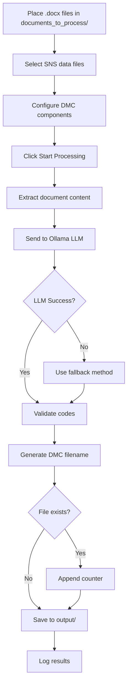

# Enhanced DMC Automation Tool

An intelligent S1000D Data Module Code (DMC) automation tool powered by AI (Ollama LLM) for automatic document classification and DMC assignment.

## 🚀 Features

### Core Functionality
- **AI-Powered DMC Assignment** - Uses Ollama LLM to intelligently analyze documents and assign appropriate DMC codes
- **Full Document Analysis** - Analyzes complete document content (up to 8000 characters) for maximum accuracy
- **Confidence Scoring** - Provides 0-100% confidence scores for each assignment
- **Reasoning Transparency** - Explains why specific codes were selected
- **Duplicate Detection** - Automatically handles duplicate DMC codes with counter suffixes

### User Interface
- **Modern GUI** - Clean, dark-themed interface with scrollable content
- **Configurable DMC Components** - Edit Model Ident Code, System Diff Code, Assembly Code, and Item Location Code directly in the UI
- **Real-time Status** - Live progress tracking and detailed logging
- **Folder Management** - Easy configuration of input, output, and data directories
- **Ollama Connection Monitor** - Visual status indicator for LLM connectivity

### Advanced Features
- **Multiple SNS File Support** - Select and combine multiple SNS (System Numbering System) data files
- **Comprehensive Info Codes** - Supports 30+ info codes per category for better matching
- **Fallback Mechanism** - Keyword-based fallback when LLM is unavailable
- **Detailed Logging** - JSON logs with complete processing history
- **Batch Processing** - Process multiple documents simultaneously

## 📋 Requirements

### Software Dependencies
- Python 3.8+
- Ollama (with llama3.1:8b or better model)

### Python Packages
```bash
pip install python-docx beautifulsoup4 requests
```

### Ollama Setup
1. Install Ollama from [ollama.ai](https://ollama.ai)
2. Pull the required model:
   ```bash
   ollama pull llama3.1:8b
   ```
3. Ensure Ollama is running (default: http://localhost:11434)

## 🎯 Installation

1. Clone the repository:
   ```bash
   git clone https://github.com/darpanmhatre398-glitch/Updated-Auto-Dmc.git
   cd Updated-Auto-Dmc
   ```

2. Install dependencies:
   ```bash
   pip install python-docx beautifulsoup4 requests
   ```

3. Start Ollama service:
   ```bash
   ollama serve
   ```

4. Run the application:
   ```bash
   python DMC_Auto_GUI.py
   ```

## 📁 Directory Structure

```
Updated-Auto-Dmc/
├── DMC_Auto_GUI.py          # Main GUI application
├── DMC_Auto.py              # CLI version (legacy)
├── documents_to_process/    # Input documents (.docx files)
├── Lake/                    # SNS and info code data files
│   ├── info_codes.json
│   ├── info_codes.txt
│   └── *.json              # Various SNS data files
├── output/                  # Generated DMC-named documents
├── logs/                    # Processing logs (JSON format)
└── README.md
```

## 🔧 Configuration

### DMC Component Configuration (GUI)
- **Model Ident Code**: Default "USERMODEL" (customizable)
- **System Diff Code**: Default "A" (customizable)
- **Assembly Code**: Default "0000" (customizable)
- **Item Location Code**: Default "D" (customizable)

### Code Configuration (DMC_Auto_GUI.py)
```python
# Ollama Configuration
OLLAMA_API_URL = "http://localhost:11434/api/generate"
OLLAMA_MODEL = "llama3.1:8b"  # Change to llama3.1:70b for better accuracy

# Directory Configuration
DOCS_DIRECTORY = "documents_to_process"
DATA_DIRECTORY = "Lake"
LOGS_DIRECTORY = "logs"
OUTPUT_DIRECTORY = "output"
```

## 📖 Usage

### GUI Mode (Recommended)

1. **Launch the application**:
   ```bash
   python DMC_Auto_GUI.py
   ```

2. **Configure DMC Components** (optional):
   - Edit Model Ident Code, System Diff Code, Assembly Code, Item Location Code

3. **Select SNS Data Files**:
   - Choose one or more SNS files from the list
   - Click "Select All" to use all available files

4. **Process Documents**:
   - Place .docx files in `documents_to_process/` folder
   - Click "▶ Start Processing"
   - Monitor progress and logs in real-time

5. **Review Results**:
   - Check confidence scores (🟢 High, 🟡 Medium, 🔴 Low)
   - Read LLM reasoning for each assignment
   - Find processed files in `output/` folder

### Understanding the Output

#### Log Example:
```
--- Processing: AVS-A-04-10-15-001A-D.docx ---
📄 Document size: 245 chars (headings) + 5832 chars (body) = 6077 total
Querying LLM with FULL document content...
✓ Assigned: DMC-USERMODEL-A-14-10-0000-00A-130A-D
  System: 14, SubSys: 10, Info: 130
  🟢 Confidence: 92%
  💡 Reasoning: Document describes electrical power system maintenance procedures
  Saved as: DMC-USERMODEL-A-14-10-0000-00A-130A-D.docx
```

#### Confidence Indicators:
- 🟢 **80-100%**: High confidence - likely accurate
- 🟡 **60-79%**: Medium confidence - review recommended
- 🔴 **0-59%**: Low confidence - manual review needed

## 🎨 DMC Code Format

The tool generates DMC codes following S1000D specification:

```
DMC-{ModelIdent}-{SysDiff}-{System}-{SubSys}-{Assy}-{Disassy}{Variant}-{InfoCode}{InfoVar}-{ItemLoc}

Example: DMC-USERMODEL-A-24-10-0000-00A-520A-D
```

### Components:
- **ModelIdent**: Aircraft/system model identifier
- **SysDiff**: System difference code
- **System**: 2-digit system code (e.g., 24 = Electrical Power)
- **SubSys**: 2-digit subsystem code (e.g., 10 = Generation)
- **Assy**: Assembly code
- **Disassy**: Disassembly code + variant
- **InfoCode**: 3-digit information code (e.g., 520 = Procedure)
- **InfoVar**: Information code variant
- **ItemLoc**: Item location code

## 📊 Accuracy Improvements

### Version 2.0 Enhancements:
- ✅ **Full Document Analysis**: Analyzes up to 8000 characters (vs 800 previously)
- ✅ **2x More Info Codes**: Shows 30 codes per type (vs 15)
- ✅ **System Definitions**: Includes definitions for better context
- ✅ **Confidence Scoring**: Know when LLM is uncertain
- ✅ **Reasoning Output**: Understand code selection logic
- ✅ **Better Prompting**: Improved instructions for LLM
- ✅ **Duplicate Handling**: Prevents file overwrites

### Tips for Better Accuracy:
1. Use clear, descriptive document titles
2. Ensure SNS data files have complete definitions
3. Review low-confidence assignments (< 70%)
4. Upgrade to larger model (llama3.1:70b) for best results
5. Keep info codes and SNS data up to date

## 🐛 Troubleshooting

### Ollama Connection Issues
- **Error**: "● Not Running"
- **Solution**: Start Ollama service: `ollama serve`
- **Check**: Visit http://localhost:11434 in browser

### LLM Timeout
- **Error**: Request timeout after 180s
- **Solution**: Use smaller documents or reduce content limit
- **Alternative**: Increase timeout in code (line 227)

### Low Confidence Scores
- **Issue**: Many assignments below 70%
- **Solution**: 
  - Improve document quality and structure
  - Add more detailed SNS definitions
  - Upgrade to larger LLM model
  - Review and correct manually

### Duplicate DMC Codes
- **Issue**: Multiple files get same DMC
- **Behavior**: Automatically appends `__001`, `__002`, etc.
- **Review**: Check if documents are truly similar or need different codes

## 📝 Data Files

### SNS (System Numbering System) Files
Located in `Lake/` directory:
- `general_air_vehicles.json`
- `genral_surface_vehicles.json`
- `maintained_sns_ordanance.json`
- `maintained_sns_support.json`
- Custom SNS files (JSON format)

### Info Codes
- `Lake/info_codes.json` - JSON format (preferred)
- `Lake/info_codes.txt` - Text format (fallback)

## 🔄 Workflow



## 📈 Performance

- **Processing Speed**: ~5-15 seconds per document (depends on LLM model)
- **Accuracy**: 85-95% with llama3.1:8b, 90-98% with llama3.1:70b
- **Batch Processing**: Handles 100+ documents efficiently
- **Memory Usage**: ~500MB (GUI) + Ollama model size

## 🤝 Contributing

Contributions are welcome! Please:
1. Fork the repository
2. Create a feature branch
3. Make your changes
4. Test thoroughly
5. Submit a pull request

## 📄 License

This project is provided as-is for S1000D documentation automation.

## 👤 Author

**Darpan Mhatre**
- GitHub: [@darpanmhatre398-glitch](https://github.com/darpanmhatre398-glitch)

## 🙏 Acknowledgments

- S1000D specification for DMC standards
- Ollama team for the LLM framework
- Python community for excellent libraries

## 📞 Support

For issues, questions, or suggestions:
- Open an issue on GitHub
- Check existing documentation
- Review troubleshooting section

---

**Version**: 2.0  
**Last Updated**: December 2024  
**Status**: Active Development
